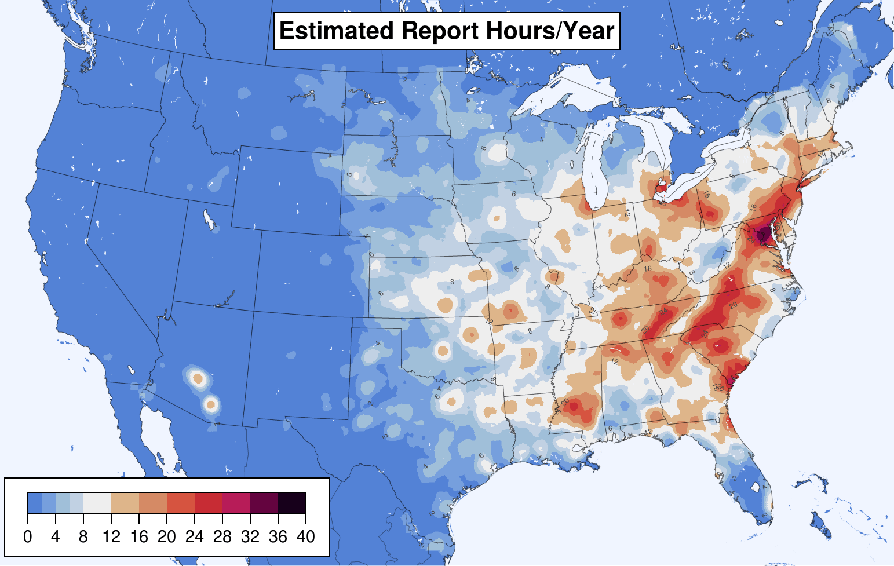
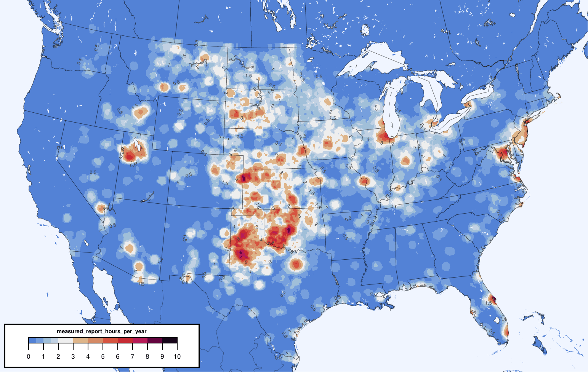
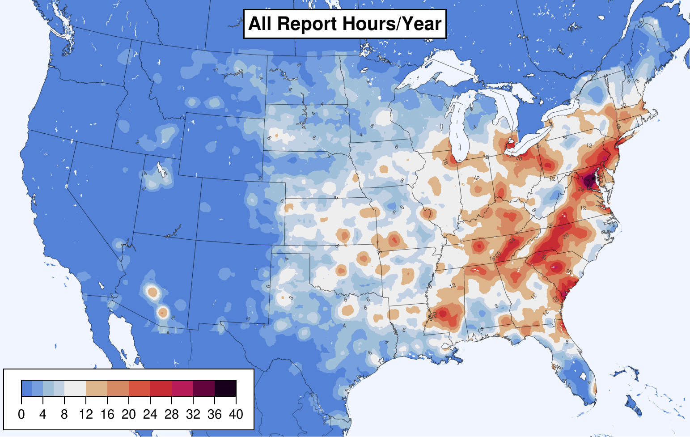
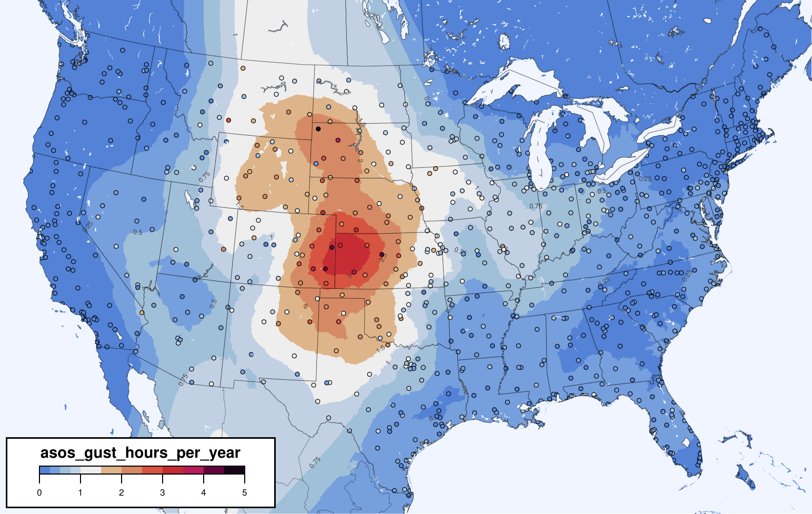
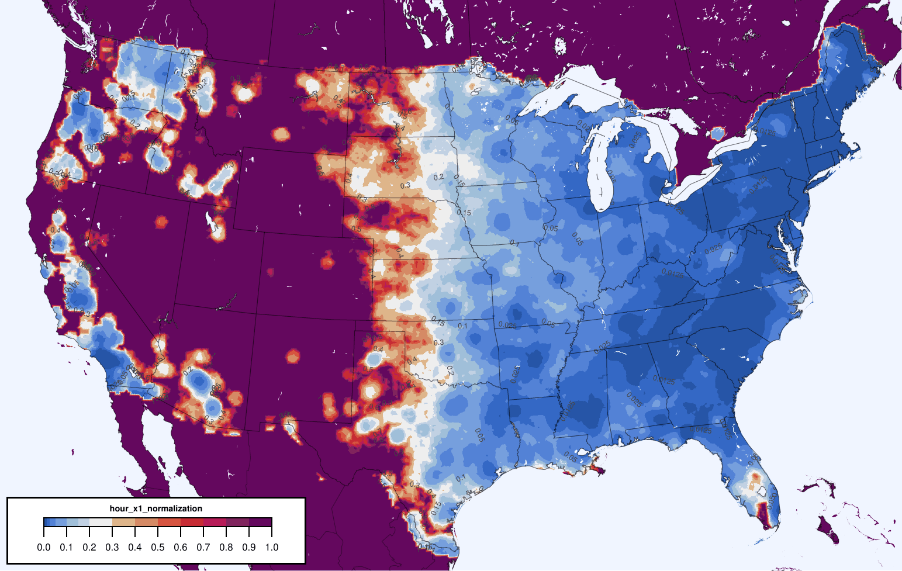
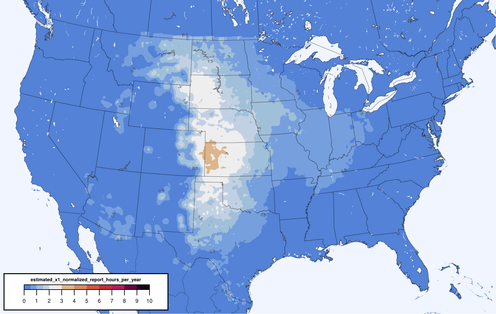
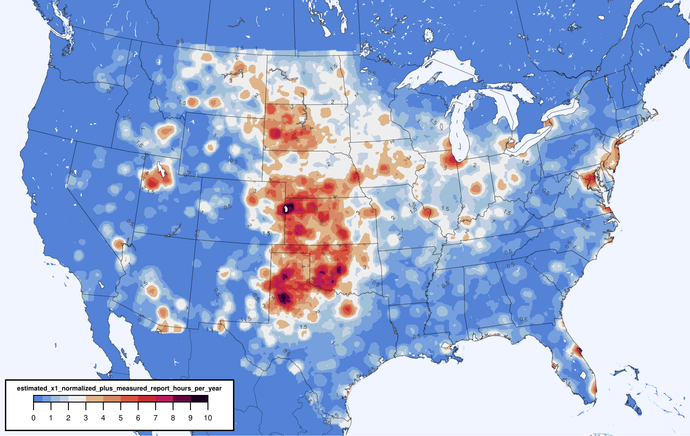

# Adjusted Severe Wind Training Target

Thunderstorm wind reports in [Storm Data](https://www.ncdc.noaa.gov/stormevents/) are coded as either "estimated" (i.e. from damage) or "measured" from an instrument. For severe wind (50+ knots), most reports (89%) are estimated, whereas only a few (11%) are measured.

Estimated reports skew towards the eastern CONUS (number of report-hours per year shown below, using a 25mi radius to look for reports).



Whereas measured reports are more common in the plains.



Together, the overall report climatology skews eastward because there are so many more estimated reports.



But, as shown in [Smith et al 2013](https://www.spc.noaa.gov/publications/smith/waf-wind.pdf) and recomputed here for 2003-2021 timeframe, [ASOS](https://www.ncei.noaa.gov/products/land-based-station/automated-surface-weather-observing-systems) permanent weather stations measure more gusts in the plains, not the east. (The scale here is gust-hours per year at a point, without considering a neighborhood.)



Reports are not telling the real story. This discrepancy is a problem for ML trained against reports. Given enough features, the ML model will learn that the east is windier, but that is not true. Training against weather stations alone is not reasonable because there are not enough of them for adequate spacial coverage.

This project computes an adjustment factor for estimated wind reports so they match the climatology of ASOS-measured severe wind gusts. Each estimated wind report is multiplied by a weight (below) based on its location in the CONUS.



This normalization results in an adjusted climatology of estimated wind reports that approximates that measured by ASOS stations:



These normalized estimated wind reports may be added back to the measured wind reports to create a training target for ML (so long as the ML algorithm can handle labels with fractional values between 0 and 1.0).



## Process

You need [Julia >=1.7](https://julialang.org/downloads/) and [Ruby >=2.7](https://www.ruby-lang.org/en/downloads/) and, for plotting, [GMT >6](https://www.generic-mapping-tools.org/download/) (ordinary GMT, not the Julia package). On a Mac, Julia downloads as an app. To make it available on the command line, symlink the binary into your `PATH`, e.g.:

```
$ ln -s /Volumes/Julia-1.7.1/Julia-1.7.1.app/Contents/Resources/julia/bin/julia ~/bin/julia
```

When the scripts complain about missing Julia packages, open a new REPL with `$ julia` and [install the packages](https://docs.julialang.org/en/v1/stdlib/Pkg/).

You will need the [Vaisala NLDN](https://www.vaisala.com/en/products/national-lightning-detection-network-nldn) quality-controlled lightning data CSVs for 2003-2021, gzipped: `jan03.lga.gz` through `dec2021.lga.gz`. These should be placed in `data_2003-2021/national_lightning_detection_network`.

Look at the top-level Makefile and run the tasks, top to bottom. Where it says so, enter the `data_2003-2021` directory and run the tasks in the `Makefile` there from top to bottom.

Some of the tasks require a bit of manual intervention, so do read the Makefiles before each task.

The `get_asos_1_min_measured_gusts` task will store all the raw ASOS data files on your computer, bzipped. That takes ~51GB. If you don't want that, find that line near the bottom of `data_2003-2021/asos_1_min_measured_gusts/get_asos6405.rb` and replace it with `system("rm #{dat_glob}")` to remove the files as they are processed. I haven't (yet) set up the pipeline to run from the bzipped files instead of downloading new files.

The final outputs are these files...

```
out/day_x1_normalization_grid_130_cropped.csv
out/fourhour_x1_normalization_grid_130_cropped.csv
out/hour_x1_normalization_grid_130_cropped.csv
out/sig_day_x1_normalization_grid_130_cropped.csv
out/sig_fourhour_x1_normalization_grid_130_cropped.csv
out/sig_hour_x1_normalization_grid_130_cropped.csv
```

...which are the normalization factors of how much a Storm Data estimated wind report at some location should be multiplied by to match the severe/sigsevere day/hourhour/hour ASOS gust climatology. The "x1" means the normalization factors are trying to make estimated reports match `g * 1`, where `g` is the ASOS gust rate at a point and `1` is a corretion factor. The ASOS climatology is gustiness at a point, not in a neighborhood, so there is an argument that `g` should be multiplied by some larger correction factor to convert the gust rate at a point to a 25mi radius neighborhood gust rate. But I cannot reasonably figure out what that correction factor is. It might be ~10. But any factor higher than 1 causes the estimated report climatology to no longer match the ASOS climatology as well. In other words, more of CONUS gets the max normalization of 1 so the adjusted estimated report climatology looks more like the unadjusted estimated report climatology. (If we could make a single report count more than 1, we wouldn't have this problem, but that is a bad idea, especially for estimated reports.) If you would like to compute and plot the resulting normalizations for higher correction factors, uncomment the appropriate lines in the Makefile.

These output files are on the 13km [AWIPS grid 130](https://www.nco.ncep.noaa.gov/pmb/docs/on388/tableb.html#GRID130), with [some rows and columns on the edges cropped off](https://github.com/brianhempel/adjusted_severe_training_targets/blob/d3e23a6437ef51dccd79606d61b1691ec82eb418/Grids.jl#L539-L561) to better fit the CONUS. The file `a_file_with_grid_130_cropped.grib2` is an example grib2 file with the cropped grid, and here are the cropped grid specs:

```
wgrib2 a_file_with_grid_130_cropped.grib2 -grid
1:0:grid_template=30:winds(grid):
        Lambert Conformal: (437 x 256) input WE:SN output WE:SN res 56
        Lat1 19.724000 Lon1 234.856000 LoV 265.000000
        LatD 25.000000 Latin1 25.000000 Latin2 25.000000
        LatSP -90.000000 LonSP 0.000000
        North Pole (437 x 256) Dx 13545.000000 m Dy 13545.000000 m 
```

The rows in all the output CSVs are in the same order as that produced by the dumping all the gridpoint coordinates with `wgrib2 a_file_with_grid_130_cropped.grib2 -end -inv /dev/null -gridout -`.

```
         1,         1, 19.724, 234.856
         2,         1, 19.751, 234.982
         3,         1, 19.777, 235.107
         4,         1, 19.804, 235.233
         5,         1, 19.830, 235.359
         6,         1, 19.856, 235.485
         7,         1, 19.883, 235.611
         8,         1, 19.909, 235.737
         9,         1, 19.935, 235.863
        10,         1, 19.960, 235.989
...
```

