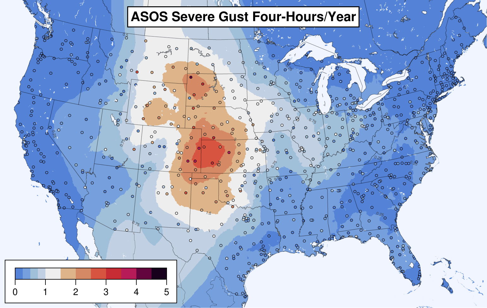
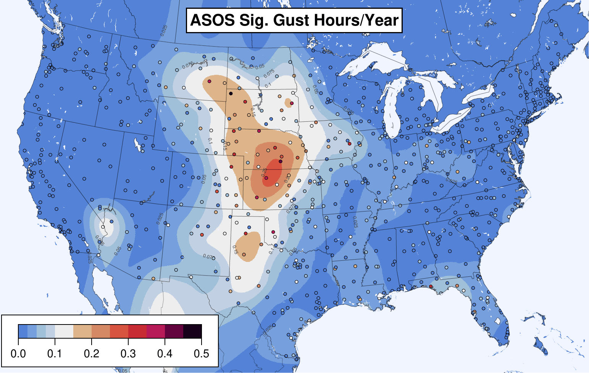
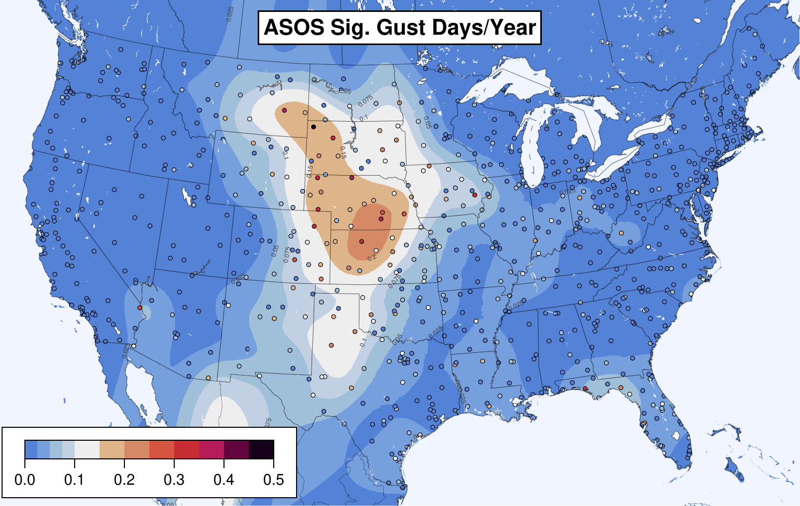
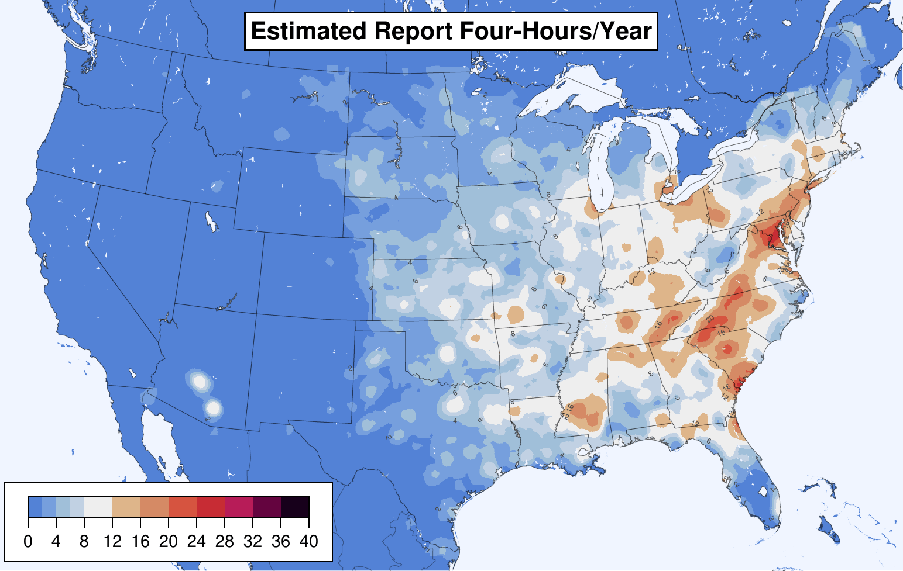
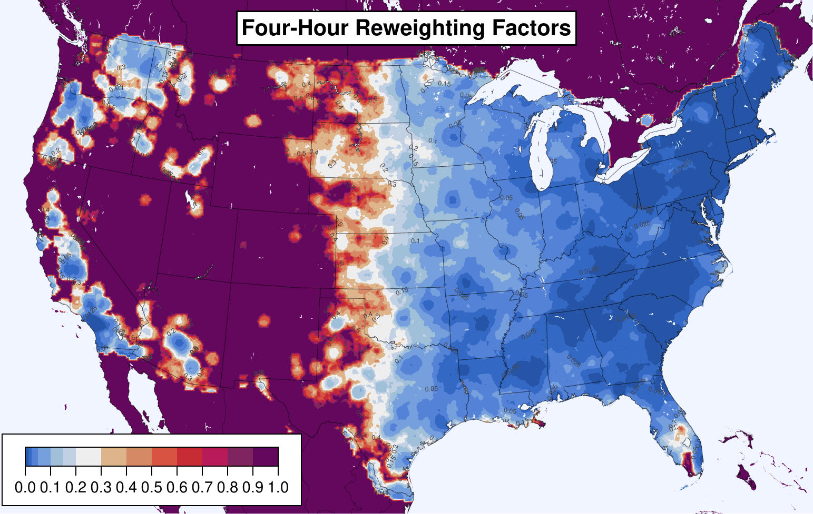

# Adjusted Severe Wind Training Target

Thunderstorm wind reports in [Storm Data](https://www.ncdc.noaa.gov/stormevents/) are coded as either "estimated" (i.e. from damage) or "measured" from an instrument. For severe wind (50+ knots), most reports (89%) are estimated, whereas only a few (11%) are measured.

Estimated reports skew towards the eastern CONUS (number of report-hours per year shown below, using a 25mi radius to look for reports).


Whereas measured reports are more common in the plains.


Together, the overall report climatology skews eastward because there are so many more estimated reports.


But, as shown in [Smith et al 2013](https://www.spc.noaa.gov/publications/smith/waf-wind.pdf) and recomputed here for 2003-2021 timeframe, [ASOS](https://www.ncei.noaa.gov/products/land-based-station/automated-surface-weather-observing-systems) permanent weather stations measure more gusts in the plains, not the east. (The scale here is gust-hours per year at a point, without considering a neighborhood.)


Reports are not telling the real story. This discrepancy is a problem for ML trained against reports. Given enough features, the ML model will learn that the east is windier, but that is not true. Training against weather stations alone is not reasonable because there are not enough of them for adequate spacial coverage.

This project computes an adjustment factor for estimated wind reports so they match the climatology of ASOS-measured severe wind gusts. Each estimated wind report is multiplied by a weight (below) based on its location in the CONUS.


This reweighting results in an adjusted climatology of estimated wind reports that approximates that measured by ASOS stations:


These reweighted estimated wind reports may be added back to the measured wind reports to create a training target for ML (so long as the ML algorithm can handle labels with fractional values between 0 and 1.0).


## Methodology

The above process consists of three steps: compiling a "ground truth" gustiness, preparing a climatology of estimated severe wind reports, and computing reweighting factors to apply to the estimated reports.

### "Ground Truth" Gustiness

The key step in the above process is computing the "ground truth" gustiness measured by ASOS permanent weather stations (the fourth plot in the previous section). Our methodology is based on that of Smith et al, albeit for the 2003-2021 time period.

> Smith, B. T., Castellanos, T. E., Winters, A. C., Mead, C. M., Dean, A. R., & Thompson, R. L. Measured Severe Convective Wind Climatology and Associated Convective Modes of Thunderstorms in the Contiguous United States, 2003–09. Weather and Forecasting, 2013. https://doi.org/10.1175/WAF-D-12-00096.1

We use the [ASOS 1 minute wind data from NCEI](https://www.ncei.noaa.gov/products/land-based-station/automated-surface-weather-observing-systems). Each [minute observation](https://www.weather.gov/media/asos/aum-toc.pdf) includes two wind speeds: the *average* wind speed over the last two minutes, and the maximum *gust* speed observed in the past minute (the maximum 3-second average speed). To transform these observations into a dataset of ASOS-measured thunderstorm wind gusts, we perform the following steps:

2. The 1 minute observations are filtered for quality control:

   1. Observation records enclosed by square brackets are discarded.

   2. Exact duplicate rows are discarded.

   3. Observations ±1 hour from an apparent calibration procedure are discarded. The procedure involves running the anemometer to 51kn and/or 76kn. Any of the following cases are presumed to indicate the procedure:

      1. A single 76kn average 76kn gust observation.
      2. A 51kn average 51kn gust observation within 10 minutes of two additional 51kn gusts.
      3. A 76kn gust observation within 10 minutes of either (two additional 76kn gusts OR another 76kn gust and a 51kn gust OR two 51kn gusts OR a single 51kn average 51kn gust observation).

   4. Cook 2022 includes a discussion of how the internal ASOS quality control algorithms are insufficient for removing spurious gusts caused by birds landing on the sensors. We apply Cook's algorithm for removing bird-generated gusts.

      > Nicholas J Cook. Curating the TD6405 Database of 1-Minute Interval Wind Observations Across the USA for Use in Wind Engineering Studies. Journal of Wind Engineering and Industrial Aerodynamics, 2022. https://doi.org/10.1016/j.jweia.2022.104961

   5. We also apply the spike removal algorithms of Cook 2014 to remove other spurious gust spikes (re-described in Cook 2022).

      > Nicholas J Cook. Detecting Artefacts in Analyses of Extreme Wind Speeds. Wind and Structures, 2014. https://doi.org/10.12989/was.2014.19.3.271

   6. Following Cook 2022, we also re-apply the ASOS sonic aneomometer QC test number 10 because it was not applied throughout the entire period of record. Test 10 removes observations with a 2 minute average speed ≤6kn, a gust speed >13 knots, and a gust factor (gust speed divided by average speed) >2.5.

   7. Finally, we remove observations with an average speed more than one knot greater than the gust speed, as well as observations with a gust speed greater than 125 knots, the maximum rating of the ASOS sensor.

2. For each convective day (12Z-12Z), we count the number of 1 minute observations that pass the above quality control. These counts are used later to determine a time range subset of the 2003-2021 period in which each ASOS station has high data quality.

3. Observations with gust speeds of at least 50kn are retained. (The scripts in this repo retain gusts ≥40kn in case we would like to analyze subsevere gusts. But to date, only ≥50kn gusts are used in the subsequent analysis.)

4. To winnow down to only wind gusts produced by convective thunderstorms, the following filters are applied:

   1. On a 40km grid, a gust is retained only if there is a lightning strike during the same hour in of the points in a 3x3 neighborhood centered on the gridpoint nearest the ASOS station. Similarly, the most unstable CAPE must also be ≥1 J/kg for at least one of the 3x3 gridpoints at the closest prior hour. Lightning data is source from the [National Lightning Detection Network](https://www.vaisala.com/en/products/national-lightning-detection-network-nldn), and CAPE information is based on archived SPC hourly mesoscale analyses.
   2. A gust is discarded if it is within 250 miles of the center of tropical cyclone currently classified as a tropical storm or hurricane, *unless* there is also a thunderstorm severe wind report nearby during the same hour (where "nearby" is defined as above: within a 3x3 neighborhood on a 40km grid).

5. Finally, for each hour, only the maximum gust is retained, resulting in 8143 station-gust-hours across 725 ASOS stations with at least one severe gust.

6. For each ASOS station, we determine a time range of quality data. Ignoring months that have no 1 minute observations that passed quality control, we determine a longest time range over which, in total, ≥90% of the one minute observations are available. Stations with at least five years of data are retained for subsequent steps, and only gusts within the high quality time range are considered.

The above results in 7653 station-gust-hours across 866 stations, of which 687 stations have at least one gust. Since each of the 866 stations has a different period of quality data, each station's gustiness is reported as a rate per year. Dots below are individual stations. The final climatology (shaded) is computed as the weighted mean of the *k*-nearest stations, where *k*=12 and the neighbor weights are determined by a spatial Gaussian with σ=150km. These parameters were chosen by hold-one-out validation: for each 40km gridpoint in the CONUS, the nearest station was removed and its gustiness estimated using various values of *k* and σ. Overall the parameters that resulted in the lowest mean absolute deviations to the held-out stations were *k*=12 and σ=150km. For significant severe gusts (≥65kn), the best interpolation was achieved by *k*=30, σ=125km.

ML models for severe weather forecasting are commonly trained for daily, hourly, or four-hourly periods. ASOS gustiness is computed for each such period, as well as for significant severe gusts.

ASOS severe gust hours per year:


ASOS severe gust four-hours per year:



ASOS severe gust days per year:


ASOS significant severe gust hours per year:



ASOS significant severe gust four-hours per year:


ASOS significant severe gust days per year:



### Reported Gustiness

Estimated severe (and significant severe) Storm Reports from Storm Data over 2003-2021 were gridded. On a 13km grid, the reports within 25mi of each point are clamped to at most 1 per hour (and four-hour and day) period. A Gaussian smoother of σ=7km is applied (σ=25km for significant severe reports), with these parameters chosen to minimize the mean absolute deviation in 5-fold cross validation, which each convective week assigned to a different fold. For points within 25 miles of the CONUS edge, the number of reports per period is altered upward according to the portion of the surrounding 25 miles that lies within the CONUS, e.g. a point exactly on the straight portion of the border with Canada will have its report count doubled because only half of its surrounding 25 miles can produce reports. This alteration is performed because the ASOS climatology does not have a similar edge artifact. (Skipping this step results in reweighting factors that upweight reports on the edge of CONUS. This is arguably desirable. But edges, if considered at all, might better be handled in an explicit step in the ML pipeline.)

The resulting estimated report climatologies are shown below.

Severe wind estimated report hours per year:


Severe wind estimated report four-hours per year:



Severe wind estimated report days per year:


Significant severe wind estimated report hours per year:


Significant severe wind estimated report four-hours per year:


Significant severe wind estimated report days per year:


### Reweighting Factors

Reweighting factors are computed to make the estimated reporting rate match the ASOS measured gustiness. The reweighting factors are each a number *y* between 0.0 and 1.0 such that each estimated report, instead of counting as 1 severe wind gust, counts as *y* severe wind gusts. As before, the sum of reweighted reports is clamped to at most 1 per period, so the math to compute these reweighting factors is not a straightforward division. Instead, the reweighting factors are discovered by binary search. The reweighting factors for each location in CONUS are shown below.

Severe wind hour-based reweighting factors:


Severe wind four-hour-based reweighting factors:



Severe wind day-based reweighting factors:


Significant severe wind hour-based reweighting factors:


Significant severe wind four-hour-based reweighting factors:


Significant severe wind day-based reweighting factors:


When each estimated wind report is adjusted to count as the reweighting factor for its location, the resulting climatologies are as shown below.

Reweighted severe wind estimated report hours per year:


Reweighted severe wind estimated report four-hours per year:


Reweighted severe wind estimated report days per year:


Reweighted significant severe wind estimated report hours per year:


Reweighted significant severe wind estimated report four-hours per year:


Reweighted significant severe wind estimated report days per year:


When the measured wind reports are added back in as is, the following climatologies result:

Measured plus reweighted estimated severe wind report hours per year:


Measured plus reweighted estimated severe wind report four-hours per year:


Measured plus reweighted estimated severe wind report days per year:


Measured plus reweighted estimated significant severe wind report hours per year:


Measured plus reweighted estimated significant severe wind report four-hours per year:


Measured plus reweighted estimated significant severe wind report days per year:


## Using the Reweighting Factors

The reweighting factors are available for use in the following files:

```
out/day_x1_reweighting_grid_130_cropped.csv
out/fourhour_x1_reweighting_grid_130_cropped.csv
out/hour_x1_reweighting_grid_130_cropped.csv
out/sig_day_x1_reweighting_grid_130_cropped.csv
out/sig_fourhour_x1_reweighting_grid_130_cropped.csv
out/sig_hour_x1_reweighting_grid_130_cropped.csv
```

These files are on the 13km [AWIPS grid 130](https://www.nco.ncep.noaa.gov/pmb/docs/on388/tableb.html#GRID130), with [some rows and columns on the edges cropped off](https://github.com/brianhempel/adjusted_severe_training_targets/blob/d3e23a6437ef51dccd79606d61b1691ec82eb418/Grids.jl#L539-L561) to better fit the CONUS. The file `a_file_with_grid_130_cropped.grib2` is an example grib2 file with the cropped grid, and these are the cropped grid specs:

```
$ wgrib2 a_file_with_grid_130_cropped.grib2 -grid
1:0:grid_template=30:winds(grid):
        Lambert Conformal: (437 x 256) input WE:SN output WE:SN res 56
        Lat1 19.724000 Lon1 234.856000 LoV 265.000000
        LatD 25.000000 Latin1 25.000000 Latin2 25.000000
        LatSP -90.000000 LonSP 0.000000
        North Pole (437 x 256) Dx 13545.000000 m Dy 13545.000000 m
```

The rows in all the output CSVs are in the same order as that produced by the dumping all the gridpoint coordinates with `wgrib2 a_file_with_grid_130_cropped.grib2 -end -inv /dev/null -gridout -`.

```
         1,         1, 19.724, 234.856
         2,         1, 19.751, 234.982
         3,         1, 19.777, 235.107
         4,         1, 19.804, 235.233
         5,         1, 19.830, 235.359
         6,         1, 19.856, 235.485
         7,         1, 19.883, 235.611
         8,         1, 19.909, 235.737
         9,         1, 19.935, 235.863
        10,         1, 19.960, 235.989
...
```

## Regenerating the Outputs

You need [Julia >=1.7](https://julialang.org/downloads/) and [Ruby >=2.7](https://www.ruby-lang.org/en/downloads/) and, for plotting, [GMT >6](https://www.generic-mapping-tools.org/download/) (ordinary GMT, not the Julia package). On a Mac, Julia downloads as an app. To make Julia available on the command line, symlink the binary into your `PATH`, e.g.:

```
$ ln -s /Applications/Julia-1.7.1/Julia-1.7.1.app/Contents/Resources/julia/bin/julia ~/bin/julia
```

When the scripts complain about missing Julia packages, open a new REPL with `$ julia` and [install the packages](https://docs.julialang.org/en/v1/stdlib/Pkg/).

You will need the [Vaisala NLDN](https://www.vaisala.com/en/products/national-lightning-detection-network-nldn) quality-controlled lightning data CSVs for 2003-2021, gzipped: `jan03.lga.gz` through `dec2021.lga.gz`. These should be placed in `data_2003-2021/national_lightning_detection_network`.

Look at the top-level Makefile and run the tasks, top to bottom. Where it says so, enter the `data_2003-2021` directory and run the tasks in the `Makefile` there from top to bottom.

Some of the tasks require a bit of manual intervention, so do read the Makefile before each task.

**Note:** the `get_asos_1_min_measured_gusts` task will store all the raw ASOS data files on your computer, bzipped. That takes ~51GB. If you don't have the space, find that line near the bottom of `data_2003-2021/asos_1_min_measured_gusts/get_asos6405.rb` and replace it with `system("rm #{dat_glob}")` to remove the files as they are downloaded and processed. I haven't (yet) set up the pipeline to run from the bzipped files instead of downloading new files. Also, NCEI does not offer these files compressed, so you will need a fast internet connection. If you don't have that, contact me and I can get you the much smaller bzipped files.

The final outputs of the entire pipeline are these files...

```
out/day_x1_reweighting_grid_130_cropped.csv
out/fourhour_x1_reweighting_grid_130_cropped.csv
out/hour_x1_reweighting_grid_130_cropped.csv
out/sig_day_x1_reweighting_grid_130_cropped.csv
out/sig_fourhour_x1_reweighting_grid_130_cropped.csv
out/sig_hour_x1_reweighting_grid_130_cropped.csv
```

...which are the reweighting factors of how much a Storm Data estimated wind report at some location should be multiplied by to match the severe/sigsevere day/hourhour/hour ASOS gust climatology. The "x1" means the reweighting factors are trying to make estimated reports match `g * 1`, where `g` is the ASOS gust rate at a point and `1` is a corretion factor. The ASOS climatology is gustiness at a point, not in a neighborhood, so there is an argument that `g` should be multiplied by some larger correction factor to convert the gust rate at a point to a 25mi radius neighborhood gust rate. But, I cannot reasonably figure out what that correction factor is. It might be ~10. And any factor higher than 1 causes the estimated report climatology to no longer match the ASOS climatology as well because more of CONUS gets the max reweighting of 1, causing the adjusted report climatology to look more like the unadjusted report climatology. (If we could make a single report count more than 1, we wouldn't have this problem, but that is a bad idea, especially for estimated reports.) If you would like to compute and plot the resulting reweightings for higher correction factors, uncomment the appropriate lines in the Makefile.

## Other Bits

The repo has a few other folders for generating plots to be used in the paper.

- `casualties/` explores the population-adjusted risk of injury from convective wind, according to the injury and death annotations on wind reports for the 2003-2021 period.
- `spc_nadocast_climatologies/` plots the climatology of SPC 13Z Day 1 wind outlooks, and the climatology of 12Z Nadocast ML predictions trained on the unadjusted and adjusted reports. The time period is 183 Sundays since July 2018 (the test set for Nadocast).
- `warnings/` plots the climatology of severe thunderstorm warnings over 2008-2021. 2008 is the first full year in which the NWS officially used storm-based warnings rather than county-based warnings.

It is not in the repo, but I also experimented with predicting unadjusted estimated wind reports using [population density](https://sedac.ciesin.columbia.edu/data/collection/gpw-v4/sets/browse) and [tree biomass](https://data.fs.usda.gov/geodata/rastergateway/biomass/). Tree biomass is less strong a predictor than you would expect. Interestingly, population density plus longitude is a better predictor than population density plus tree biomass, because the report longitude is as good a predictor as the population density:

|                    | Spearman ρ | Spearman ρ² |
| ------------------ | ---------- | ----------- |
| Population Density | 0.72       | 0.52        |
| Forest Biomass     | 0.26       | 0.068       |
| Longitude          | 0.74       | 0.55        |


(Note the Spearman correlations above are not weighted by gridpoint area, although the calculation is on a Lambert Conic Conformal grid, [NCEP grid 130](https://www.nco.ncep.noaa.gov/pmb/docs/on388/tableb.html#GRID130), so the gridpoint area differences are not extreme over the CONUS.)
