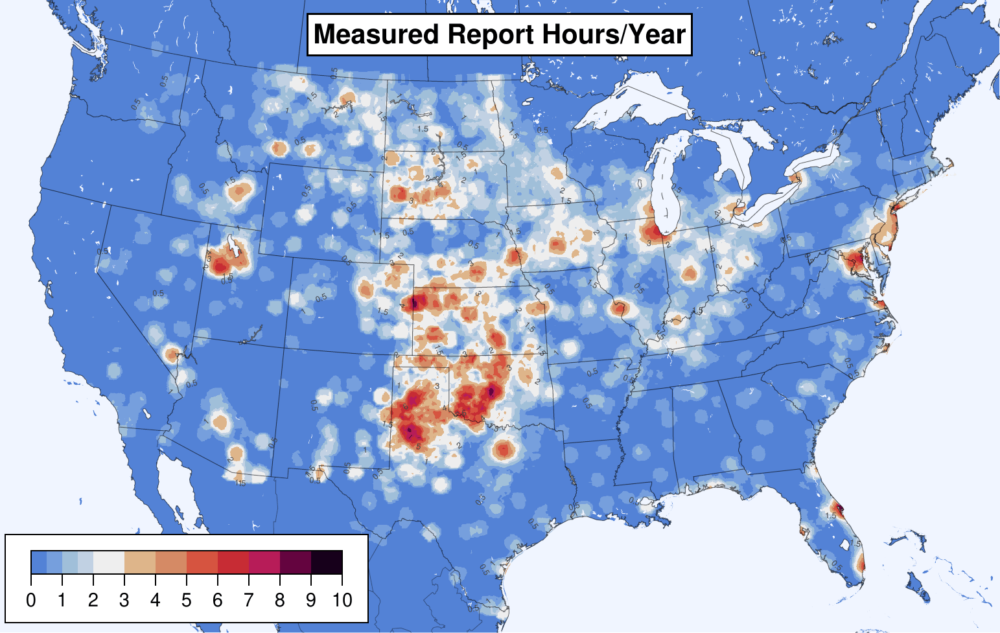

# Adjusted Severe Wind Training Target

Thunderstorm wind reports in [Storm Data](https://www.ncdc.noaa.gov/stormevents/) are coded as either "estimated" (i.e. from damage) or "measured" from an instrument. For severe wind (50+ knots), most reports (89%) are estimated, whereas only a few (11%) are measured.

Estimated reports skew towards the eastern CONUS (number within 25 miles shown below).

Whereas measured reports are more common in the plains.

Together, the overall report climatology skews eastward because there are so many more estimated reports.

But, as shown in [Smith et al 2013](https://www.spc.noaa.gov/publications/smith/waf-wind.pdf) and recomputed here for 2003-2021 timeframe, [ASOS](https://www.ncei.noaa.gov/products/land-based-station/automated-surface-weather-observing-systems) permanent weather stations measure more gusts in the plains, not the east.

Reports are not telling the real story. This discrepancy is a problem for ML trained against reports. Given enough features, the ML model will learn that the east is windier, but that is not true. Training against weather stations alone is not reasonable because there are not enough of them for adequate spacial coverage.

This project computes an adjustment factor for estimated wind reports so they match the climatology of ASOS-measured severe wind gusts. Each estimated wind report is multiplied by a weight (below) based on its location in the CONUS.

This normalization results in a climatology of estimated wind reports that, in relative magnitudes at least, approximates that measured by ASOS stations:

These normalized estimated wind reports may be added back to the measured wind reports to create a training target for ML (so long as the ML algorithm can handle labels with fractional values between 0 and 1.0).

## Process

...